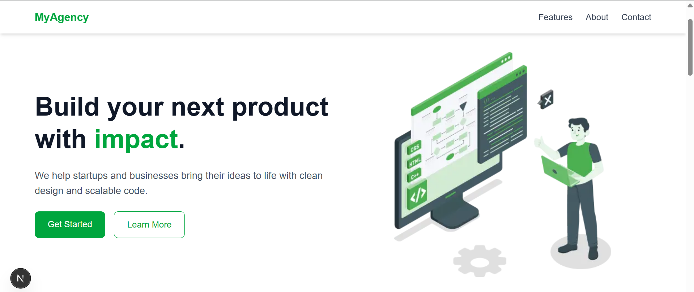
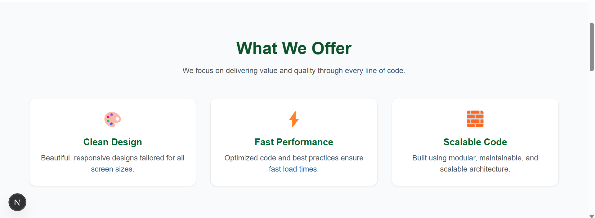
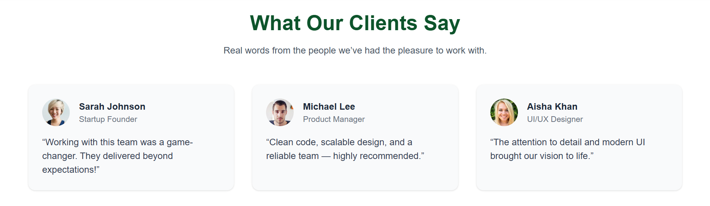
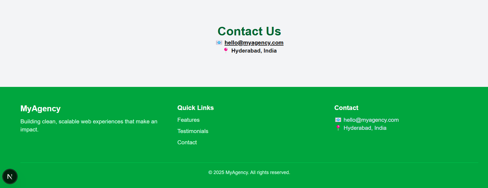

# responsive-landing-page
A mobile-responsive landing page built using **Next.js**, **Tailwind CSS**, and **TypeScript**, based on a [Figma design](https://www.figma.com/design/g02xVBnKxTuNDvm0EPpewQ/Responsive-Landing-Page-Design-%7C-Website-Home-Page-Design-%7C-Agency-Website-UI-Design--Community-?node-id=204-686&t=xloSf3HrbdaFvY58-4).
## 🚀 Live Demo
👉 [View Live](https://responsive-landing-page-seven-gilt.vercel.app)
## 📁 Features
- ⚡ Fully responsive for mobile, tablet, and desktop
- 🎨 Tailwind CSS for utility-first styling
- 💡 Clean and modern layout (Hero, Features, Testimonials, Footer)
- 🚀 Deployed on Vercel
## 🛠️ Tech Stack
- [Next.js](https://nextjs.org/)
- [Tailwind CSS](https://tailwindcss.com/)
- TypeScript
## 📷 Screenshots





## 🔧 Run Locally
1. ```bash
   git clone https://github.com/Nagoluaadhi/responsive-landing-page.git
   ```
2. ```bash
   cd responsive-landing-page
   ```
3. ```bash
   npm install
   ```
4. ```bash
   npm run dev
   ```
